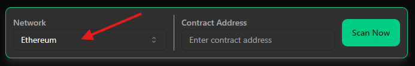

# 🟢 Watchlist

The OnChain Toolkit features a powerful and user-friendly Watchlist system, designed to enhance the trading experience by allowing users to efficiently track and monitor their favorite tokens. This tool provides traders with the ability to compile a personalized list of tokens, which can be referenced quickly for real-time market data, ensuring that they stay informed and ready to make critical trading decisions.

***

### **Easy Token Addition and Management**

Users can easily add tokens to their Watchlist with just a few clicks. This allows for quick access to frequently monitored tokens without needing to search for them repeatedly. The interface is intuitive, making it simple to manage and update the Watchlist as market conditions evolve.

<figure><figcaption></figcaption></figure>

### **Real-Time Market Data**

<figure><figcaption></figcaption></figure>

Once tokens are added to the Watchlist, users can view a range of important real-time metrics:

* **Token Price**: Stay updated with the latest price of each token in the Watchlist.
* **Percentage Price Change (1 Hour & 24 Hours)**: View how the token’s price has fluctuated over the last hour and the last 24 hours, providing insights into short-term trends.
* **Trading Volume**: Monitor the token’s trading volume to gauge market activity.
* **Liquidity Pool Value**: Access information on the total value locked in the liquidity pools associated with each token, which is crucial for understanding market depth and potential slippage.

These metrics are presented in an organized manner, enabling users to make well-informed trading decisions quickly.

**3. Sorting and Filtering Options**\
To further enhance usability, the Watchlist includes sorting and filtering functionalities. Users can sort tokens by price, percentage changes, or liquidity pool value, allowing them to prioritize the information most relevant to their trading strategy. By clicking on the sorting arrows, users can reorder their list according to these metrics, making it easier to spot opportunities or manage risks.

**4. Customizable Display Settings**\
The Watchlist is designed to be flexible to accommodate different user preferences:

* **Token Limit**: Users can add up to 100 tokens to their Watchlist, ensuring they can monitor a broad range of assets.
* **Adjustable Row Display**: The number of tokens displayed per page can be customized, with options to display 10, 20, 30, 40, or 50 tokens per page. This feature allows users to tailor the interface to their viewing comfort and the scale of their Watchlist.

**5. Seamless Navigation and User Experience**\
Navigating through the Watchlist is made simple with the ability to quickly scroll through pages, jump to specific pages, and search for tokens within the Watchlist. The interface is designed to be responsive, ensuring that all relevant data is accessible on various devices, including desktops, tablets, and mobile phones.

**Benefits of Using the Watchlist**

The Watchlist is an essential tool for traders who need to stay on top of multiple tokens simultaneously. By offering real-time insights and a highly customizable interface, it allows users to:

* **Optimize Decision-Making**: With critical data at their fingertips, traders can make faster and more informed decisions.
* **Streamline Monitoring**: Rather than manually checking individual token metrics, users can consolidate their tracking into one streamlined view.
* **Enhance Trading Efficiency**: The ability to quickly sort and filter tokens helps users identify trading opportunities and manage their portfolio more effectively.

In summary, the OnChain Toolkit’s Watchlist is an indispensable feature for any trader looking to keep a close eye on the market. Whether you are tracking short-term price movements or analyzing long-term trends, this tool provides the functionality and data you need to trade with confidence.
