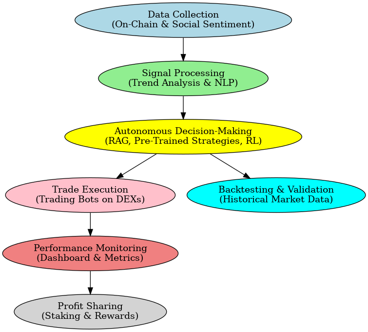

# ⚡ Autonomous Trading Agent

### I**ntroduction**

The OnChain Toolkit Autonomous Trading Agent simplifies decentralized finance (DeFi) by providing users with seamless access to advanced trading strategies. This innovative tool combines real-time market data, social sentiment analysis, and algorithmic trading to empower users to earn passive income through copy-trading while maintaining full transparency and security.

This document outlines the core features of the trading agent, its underlying technology, and how users can benefit from its transparent and decentralized architecture.

<figure><figcaption></figcaption></figure>

**Key Features**

* **Automated Trading**: Operates 24/7 on decentralized exchanges (DEXs) using data-driven strategies executed via trading bots for speed and efficiency.
* **Copy-Trading**: Allows users to mirror the agent’s trades and earn proportional returns based on its performance.
* **Social Sentiment Integration**: Leverages NLP and real-time data from platforms like Twitter and Telegram to detect trends and optimize strategies.
* **Transparency**: All activities are visible on-chain, ensuring users retain custody of their funds via audited smart contracts.
* **Autonomous Decision-Making**: Utilizes Retrieval-Augmented Generation (RAG) to fetch and process token data in real-time, enabling dynamic decision-making based on market conditions.
  * **Pre-Trained Strategies**: Relies on backtested strategies to assess market trends, risk, and liquidity for executing trades.
  * **Reinforcement Learning**: Optimizes trading strategies over time by learning from successes and failures in previous trades.

**How It Works**

1. **Data Collection**: Aggregates real-time on-chain data (e.g., prices, liquidity) and social sentiment signals.
2. **Signal Processing**: Combines these inputs to identify profitable trade opportunities.
3. **Execution**: Executes trades on DEXs using optimized strategies through trading bots.
4. **Performance Monitoring**: Tracks returns, trade history, and portfolio metrics via an intuitive dashboard.
5. **Profit Sharing**: Users stake funds, earning rewards proportional to the agent’s success. A small performance fee is retained by the platform to cover operational costs, ensuring sustainability. Additionally, a percentage of this fee will be allocated to buy back and burn our native token, supporting its value and scarcity.

**Backtesting and Validation** Before the agent becomes available for user copy-trading, it undergoes extensive backtesting using historical market data. This ensures that the strategies deployed are robust, profitable, and capable of adapting to various market conditions.

**Trading Strategies**

* **Trend-Following**: Trades in the direction of prevailing market trends.
* **Mean Reversion**: Identifies assets deviating from historical averages.
* **Volatility Exploitation**: Capitalizes on price fluctuations during high volatility.
* **Sentiment-Driven Decisions**: Enters positions based on emerging narratives detected early.

**User Benefits**

* **Passive Income**: Stake funds to earn consistent returns without active trading involvement.
* **Advanced Insights**: Access cutting-edge AI-powered strategies.
* **Security**: Funds are secured by audited smart contracts with full on-chain transparency.
* **Control**: Withdraw funds anytime with no lock-in periods.

**Technology Stack**

* **Smart Contracts**: Secure, non-custodial systems manage funds and trades.
* **Data Sources**: Oracles (e.g., Chainlink), NLP models, and API integrations for real-time insights.
* **User Interface**: Comprehensive dashboard for tracking and engagement.

**Conclusion** The OnChain Toolkit Autonomous Trading Agent democratizes access to sophisticated trading tools, enabling users to effortlessly participate in DeFi markets. By combining automation, real-time data, Retrieval-Augmented Generation (RAG), and transparency, the platform provides a powerful solution for passive income generation and strategic market participation.
