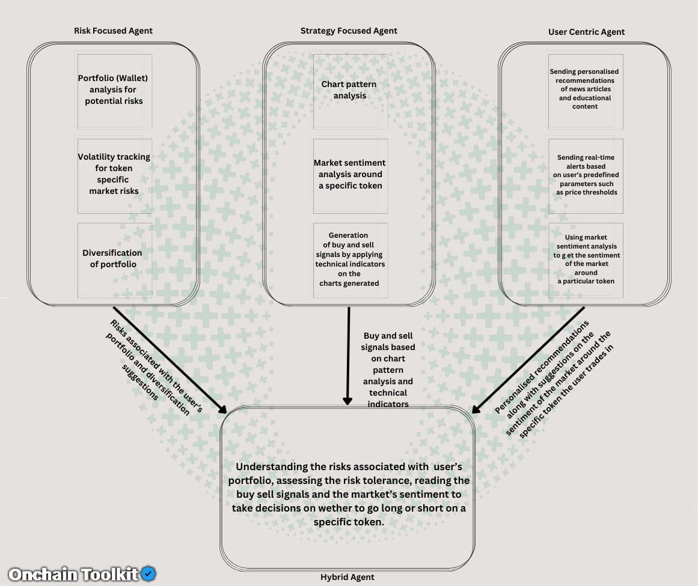

# Innovative Multi-Agent Trading System

This framework outlines a strategic design for a multi-agent trading system based on extensive research. Onchain Toolkit employs four distinct agents, each playing a specific role in the trading workflow. The initial trio of agents specializes in different trading functions: risk analysis, strategy development, and user interaction. They utilize targeted data to execute their roles—assessing risks in the portfolio, creating strategies based on technical analysis and market trends, and providing users with tailored advice and immediate notifications. The fourth agent, an integrative one, synthesizes information from the first three and incorporates human judgment to make the ultimate trading decisions. The system maximizes performance through GPU integration, capitalizing on the unique strengths of each agent to enhance trading in a unified and strategic manner.

<figure><figcaption></figcaption></figure>

## <mark style="color:green;">Risk-Focused Agent</mark>

**Portfolio Analysis:** A cryptocurrency wallet stores both public and private keys for digital assets such as cryptocurrencies. When a user provides their wallet address, it grants access to their public keys and enables the tracking of transactions and token activities. APIs, such as Goplus, scan liquidity pools for various tokens, revealing transactions related to a user's digital assets.

* **By connecting a user's wallet, the system can access**:

1. The wallet address, which helps in monitoring cryptocurrency balances and spending limits.
2. Transaction history, including details of incoming and outgoing transfers, timestamps, amounts, and recipients.
3. Trading patterns, showing how the user interacts with different liquidity pools, which indicates their preferred digital assets.
4. This data is essential for conducting a thorough risk assessment of the user’s portfolio, utilizing GPU-enhanced algorithms for enhanced analysis

* **Volatility Tracking:** The agent uses indicators such as the Crypto Volatility Index (CVI), Bollinger Bands (BB), Average True Range (ATR), and Average Directional Index (ADX) to track market volatility. Through the Gecko terminal API, it gathers price, volume, and historical data for tokens, which is used to plot a candlestick chart of OHLCV data based on the token’s pool address. Applying ATR and ADX indicators to these charts helps in analyzing market volatility for specific tokens.
* **Diversification:** The agent assesses correlations between assets using details from the user’s wallet to suggest diversification strategies. It utilizes platforms like TradingView to analyze how prices of different cryptocurrencies correlate, determining if they move together or in opposite directions. This correlation analysis, facilitated by Gecko Terminal API, aids in identifying suitable diversification strategies to reduce risk in the user’s investment portfolio.

## <mark style="color:green;">Strategy-Oriented Agent</mark>

* **Chart Pattern Analysis:** Historical data is analyzed using technical indicators from the Ta-Lib Python library, which is known for its technical analysis capabilities. For advanced financial analysis, we also incorporate Quant-Lib to examine chart patterns thoroughly.
* **Market Sentiment Analysis:** To track the public mood surrounding specific trading assets, we perform sentiment analysis, allowing users to query news about their traded assets. The system dynamically creates URLs to fetch news in JSON format, converting this information into text documents. Each article is categorized by date, title, content, and sentiment. A ranking system scores these documents based on sentiment and other factors. Queries about specific assets are answered using a Large Language Model, which selects the highest-ranked document from a vector database, crafting responses that aid users in adjusting their trading strategies.
* **Buy and Sell Signals:** We use the technical indicators provided by the Ta-Lib library to generate buy and sell signals. These signals are formulated based on specific settings of the indicators, aiding in strategic decision-making in various trading scenarios.

## <mark style="color:green;">User-Centric Agent</mark>

* **Personalized Recommendations:** This agent analyzes the user’s trading history accessed through their cryptocurrency wallet, which includes monitoring their trading behaviors. It identifies the cryptocurrencies the user actively trades and provides them with tailored news and educational content related to those specific currencies to enhance their trading knowledge and strategies.
* **Real-Time Alerts:** The agent sends real-time alerts to the user based on specific criteria they set, such as price thresholds or technical indicator values. This feature helps users react promptly to market changes and optimize their trading decisions with.
* **Market Sentiment Analysis:** By leveraging sentiment analysis on news data, this agent assesses the general mood towards particular cryptocurrencies. It uses this information to send timely alerts to the user about significant sentiment shifts, aiding them in making well-informed trading decisions based on the prevailing market attitudes.

## <mark style="color:green;">Hybrid Agent</mark>

* **Integration of Inputs:** This advanced learning agent synthesizes inputs from all the previous agents. It collects information on portfolio risks from the risk-focused agent, understanding the user's risk tolerance through the strategy-focused agent's analysis of their trading behaviors. Additionally, the user-centric agent provides insights into market sentiment regarding the cryptocurrencies the user is involved with, utilizing GPU acceleration for enhanced processing.
* **Decision Making Based on Comprehensive Analysis:** If market sentiment analysis suggests a negative outlook for a specific cryptocurrency, the hybrid agent considers this when making trading decisions. It is responsible for executing buy and sell actions based on signals generated by the strategy-focused agent, incorporating real-time adjustments from human intelligence if necessary before the closure of a trade.
*   **Execution of Trades:** The agent's trading decisions are finely tuned to the combined insights from risk assessment, strategic planning, and sentiment analysis. Upon connecting a user’s wallet and accessing various pool addresses, the hybrid agent leverages GPU optimizations to execute trades directly through platforms like Tradingview. Using API integration, it manages transactions efficiently and effectively. This holistic approach ensures that trading strategies are robust, responsive, and aligned with both market conditions and the user's specific trading profile.

    \

## <mark style="color:green;">Future Scopes</mark>

Incorporating statistical and machine learning techniques to analyze risk factors across portfolios, for instance, by using variance-covariance matrices and Monte Carlo simulations through the Quant-lib Python library to estimate potential losses in varying market conditions. Additionally, deploying deep learning models to assess and forecast the effectiveness of different chart patterns and technical indicators. Designing algorithms to identify price differences across various exchanges and executing trades to leverage these discrepancies, all while complying with exchange regulations and addressing latency concerns.
